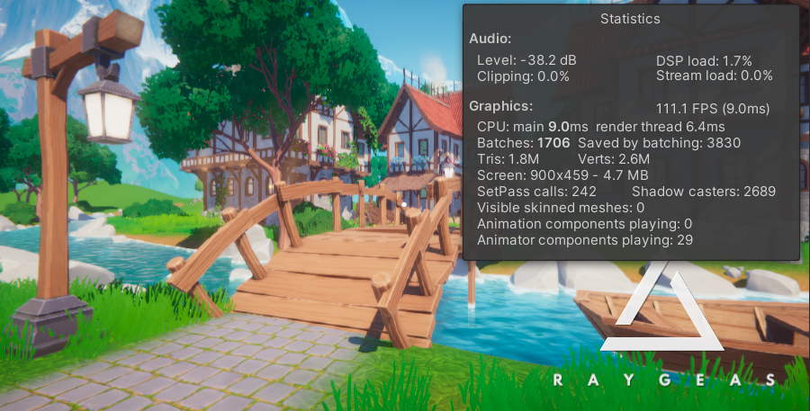
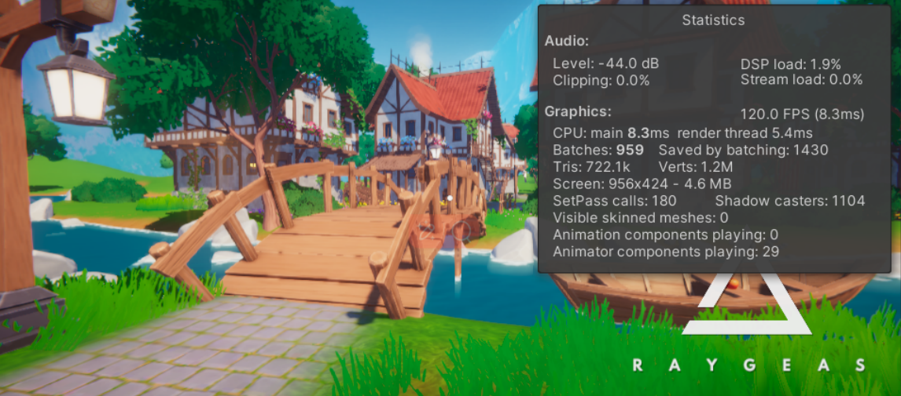

### 幻想村庄案例基于安卓平台的优化:

***

##课程链接：
https://www.bilibili.com/video/BV1AL4y1b75c/?spm_id_from=333.788&vd_source=ebc85d1ae1c7577dccd9922b134f7276

***

##项目资源：
https://assetstore.unity.com/packages/3d/environments/fantasy/suntail-stylized-fantasy-village-203303

***

## Feature
- [x] 静态资源优化
  - [x] 音频格式，配置优化
  - [x] 顶点处理
  - [x] 纹理overdraw，过滤方式，检查
- [x] 预制体处理
  - [x] 大模型LOD拆分
- [x] 光影处理
  - [x] CSM分帧更新
  - [x] 平坦地面取消接收阴影
- [x] 性能瓶颈优化
  - [x] SSAOpass纹理降采样，降低采样数量
- [x] 场景分析
  - [x] 反射探针烘焙天空盒

